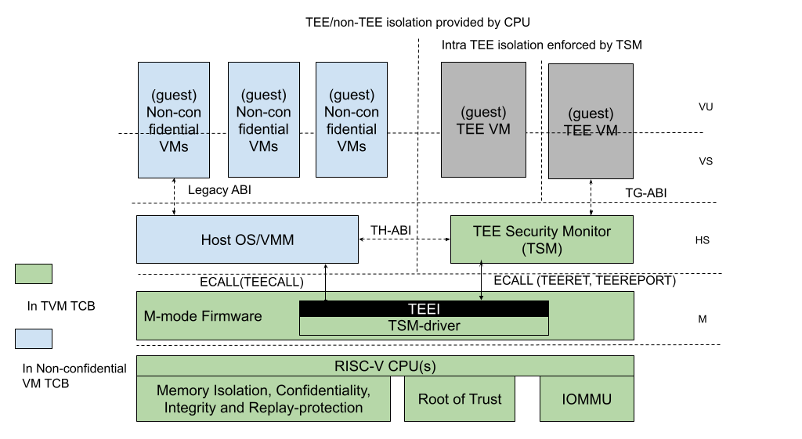
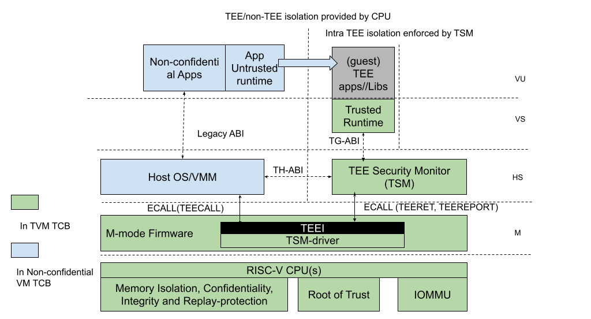
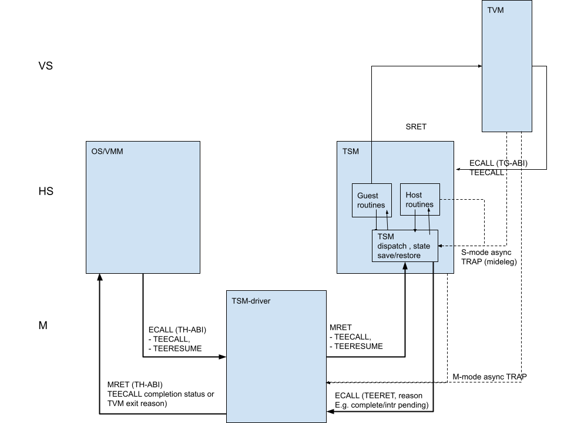
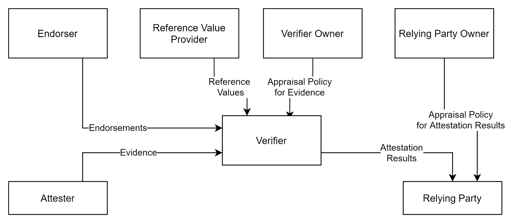
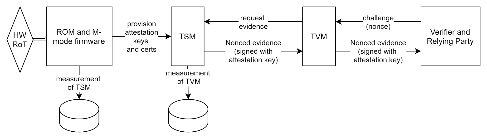
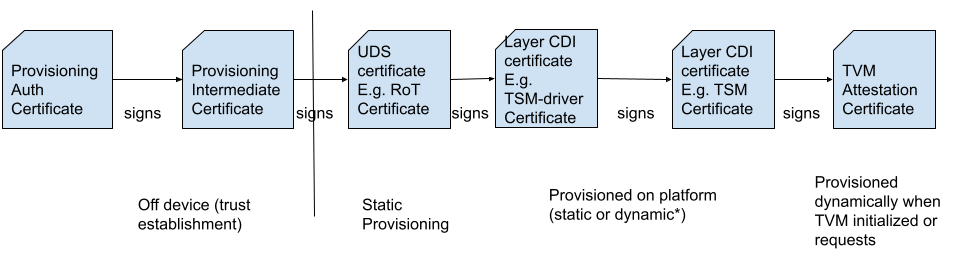

= AP-TEE: HW-Attested Scalable TEE proposal for RISC-V
:toc: macro
:idprefix:

Editor: Ravi Sahita Date: February 14th, 2022

*The following is a proposal being submitted by Rivos Inc. for the purposes 
of discussion and collaboration to eventually produce a RISC-V Standard. At 
this time, this is an initial proposal and is not an official draft of a 
RISC-V Specification.*

*Table of Contents*

toc::[]

== 1. Introduction
:toc: macro

This document describes a scalable Application-Processor Trusted Execution 
Environment (AP-TEE) interface proposal for RISC-V-based platforms. This 
AP-TEE interface specification enables application workloads that require 
confidentiality to reduce the Trusted Computing Base (TCB) to a minimal 
TCB, specifically, keeping the host OS/VMM and other software outside the 
TCB. The proposed specification supports an architecture that can be used 
for Application and Virtual Machine workloads, while minimizing changes 
to the RISC-V ISA and privilege modes.

== 2. Notation

The key words "MUST", "MUST NOT", "SHOULD", and "SHOULD NOT", in this 
document are to be interpreted as described in  RFC 2119.

|===
| MUST       | This word, or the terms "REQUIRED" or "SHALL", means that the 
definition is an absolute requirement of the specification.

| MUST NOT   | This phrase, or the phrase "SHALL NOT", means that the 
definition is an absolute prohibition of the specification.

| SHOULD     | This word, or the adjective "RECOMMENDED", means that there 
may exist valid reasons in particular circumstances to ignore a particular 
item, but the full implications must be understood and carefully weighed before 
choosing a different course.

| SHOULD NOT | This phrase, or the phrase "NOT RECOMMENDED" means that 
there may exist valid reasons in particular circumstances when the particular 
behavior is acceptable or even useful, but the full implications should be 
understood and the case carefully weighed before implementing any behavior 
described with this label.  
|===

== 3. Glossary

|===
| Hypervisor or Virtual Machine Monitor (VMM) | HS mode software 
that manages Virtual Machines by virtualizing hart, guest physical memory and 
IO resources. This document uses the term VMM and hypervisor interchangeably 
for this software entity.

| VM | Virtual Machines hosted by a VMM

| Host software | All software elements including type-1 or type 2 HS-mode VMM 
and OS; U mode user-space VMM tools; ordinary VMs hosted by the VMM that 
emulate devices. The hosting platform is typically a multi-tenant platform 
that hosts multiple mutually distrusting Tenants.

| Tenant software | All software elements including VS-mode guest kernel 
software, and guest user-space software (in VU-mode) that are deployed 
by the workload owner (in a multi-tenant hosting environment).

| Trusted Computing Base (TCB)Also, System/ Platform TCB | The hardware, 
software and firmware elements that are trusted by a relying party to 
protect the confidentiality and integrity of the relying parties' workload 
data and execution against a defined adversary model. In a system with 
separate processing elements within a package on a socket, the TCB 
boundary is the package. In a multi-socket system the TCB extends across 
the socket-to-socket interface, and is managed as one system TCB.

| Application Processor (AP) | APs can support commodity operating systems,
 hypervisors/VMMs and applications software workloads. The AP subsystem 
 may contain several processing units, on-chip caches, and other controllers 
for interfacing with memory, accelerators, and other fixed-function logic. 
Multiple APs may be used within a logical system.
 
| AP-TEE | Application Processor- Trusted Execution Environment: An execution 
mode that provides HW-isolation for workload assets when in use (user/ 
supervisor code/ data) and provides HW-attestable confidentiality and 
integrity protection against specific attack vectors per a specified 
adversary and threat model. The term TEE and hardware-based TEE are also 
used as synonyms of AP-TEE in this document.
 
| Confidential Computing | The protection of data in use by performing 
computation in a Hardware-based TEE.

| TVM or Confidential VM | A VM instantiation of an AP-TEE workload - 
aka a TEE VM, TVM or a CVM.

| Confidential application or library | A user-mode application or 
library instantiation in a TVM. The user-mode application may be supported 
via a trusted runtime. The user-mode library may be hosted by a surrogate 
process runtime.

| Attestation | The process by which a relying party can assess the 
security posture of the AP-TEE workload based on verifying a set of 
HW-rooted cryptographically-protected evidence.
 
| TEE Security Manager (TSM) | HS-mode software module that acts as 
the trusted (in TCB) intermediary between the VMM and the TVM. This 
module extends the TCB chain on the AP-TEE platform.

| RoT | Isolated HW/SW subsystem with an immutable ROM firmware and 
isolated compute and memory elements that forms the Trusted Compute Base 
of a TEE system. The RoT manages cryptographic keys and other security 
critical functions such as system lifecycle and debug authorization. 
The RoT provides trusted services to other software on the platform such 
as verified boot, key provisioning, and management, security lifecycle 
management, sealed storage, device management, crypto services, 
attestation etc. The RoT may be an integrated or discrete element <<R7>>, 
and may take on the role of a Device Identification Composition Engine 
(DICE) as defined in <<R2>>.

| TEE-capable memory | Memory that provides access-control, confidentiality 
and integrity suitable per the threat model for use in the AP-TEE system. 
TEE-capable memory may also be used by untrusted software with appropriate 
TCB controls on the configuration.

| SVN | Security Version Number - Meta-data about the TCB components 
that conveys the security posture of the TCB. The SVN is a monotonically 
increasing version number updated when security changes must be reflected in 
the attestation. The SVN is hence provided as part of the attestation 
information as part of the evidence of the TCB in use. The SVN is typically 
combined with other meta-data elements when evaluating the attestation 
information. 

| CDI | Compound Device Identifier - This value represents the hardware, 
software and firmware combination measured by the TCB elements transitively. 
A CDI is the output of a DICE [2] and is passed to the entity  which is 
measured by the previous TCB layer. The CDI is a secret that may be 
certified to use for attestation protocols. 

|===

== 4. Architecture Overview and Threat Model

The AP-TEE extension supports a new class of hardware-attested trusted 
execution environment called TEE Virtual machines (TVM). The TVMs are 
supported by a hardware-rooted, attestable TCB and are run-time-isolated from 
the host OS/VMM and other platform software not in the TCB of the TVM. TVMs 
are protected from a broad set of software-based and hardware-based threats 
per the threat model described in <<4_1_adversary_model>>. The design enables 
the OS or VMM to maintain the role of resource manager even for the TVMs. The 
resources managed by the untrusted OS/VMM include memory, CPU, I/O resources 
and platform capabilities to execute the TVM workload.

|===
| 
|===
Figure 1: TEE TCB for VM workloads

As shown in figure 1, the architecture comprises a HS-mode software module 
called the " *TEE Security Manager* " *(TSM)* that acts as the trusted 
intermediary between the VMM and the TVM. The TSM implements a set of TEE 
“flows” that are accessed via a *Trusted Execution Environment Interface 
(TEEI)* ABI hosted by a Trusted Security Manager Driver ( *TSM Driver* ) 
component operating in the M-mode of the CPU. The TSM itself operates in 
HS-mode (priv=01; V=0) of the CPU and enables the OS/VMM (also in HS-mode) to 
create TVMs, assign resources to TVMs, manage/execute and destroy a TVM - 
_this specification aims to describe the TEEI and TSM interfaces_ . By using 
the Hypervisor extension of the RISC-V privileged specification <<R0>>, this 
specification minimizes ISA changes to introduce a scalable architecture for 
hosting TEE workloads. More than one TVM may be hosted by the host OS/VMM. 
Each TVM may consist of the guest firmware, a guest OS and applications.

As shown in figure 1, the M-mode firmware is in the TCB of all AP-TEE 
workloads hosted on the platform. The TSM-driver (operating in M-mode) uses 
the hardware capabilities to  provide:

* Isolation of memory associated with TEEs (including the TSM). We describe 
*TEE- capable memory* as memory that provides access-control, confidentiality 
and integrity suitable for use for AP-TEE components. The TEEI operations for 
memory management are described in detail below. 
* Context switching of the hart state on TEE/Non-TEE transitions.
* A machine agnostic ABI as part of the TEEI, to allow lower privileged 
software to interact with the TSM-driver in an OS and platform agnostic manner.

The TSM-driver delegates parts of the TEE management functions to the TSM, 
specifically  isolation across TEE-capable memory assigned to TVMs. The TSM is 
designed to be portable across AP-TEE class platforms and interact with the 
machine specific capabilities in the platform through the TEEI. The TSM 
provides an ABI to the OS/VMM which has two aspects: A *TH-ABI* that includes 
functions to manage the lifecycle of the TVM, such as creating, adding pages 
to a TVM, scheduling a TVM for execution, etc. in an OS/platform agnostic 
manner. The TSM also provides an ABI to the TVM contexts: A *TG-ABI* to enable 
the TVM workload to request attestation functions, memory management  
functions or paravirtualized IO functions.

In order to isolate the TVMs from the host OS/VMM and non-confidential VMs, 
the TSM state must be isolated first - this is achieved by enforcing isolation 
for memory assigned to the TSM - this is called the *TSM-memory-region.* The 
TSM-memory-region is expected to be a static region of memory that holds the 
TSM code and data. This region must be access-controlled from all software 
outside the TCB, and may be additionally protected against physical access via 
cryptographic mechanisms. Access to the TSM- memory-region and execution of 
code from the TSM-memory-region (the TSM flows) is predicated in hardware via 
an *AP-TEE mode bi* *t* maintained per hart. This mode is enabled per-hart via 
TEECALL and disabled via TEERET for operations described in the TEEI. Access 
to TEE-assigned memory is allowed for the hart when the AP-TEE mode is set. 
This per-hart AP-TEE mode bit is used by the processor to enforce 
access-control properties on instructions restricted for use by the TSM. This 
bit is cached in other micro-architectural states to enforce the isolation for 
TEE (TSM, TVM) resources (such as memory, IO, CSRs, TLB, paging structure 
caches etc). The implementation of this mode  bit  is not specified by this 
document, and may be implemented via an M-mode CSR for example.

The TSM functionality is explicitly limited to support the necessary security 
primitives to ensure that the OS/VMM and non-confidential VMs do not violate 
the security of the TVMs through the resource management actions of the 
OS/VMM. These security primitives require the TSM to enforce TVM virtual-hart 
state save and restore,  as well as enforcing invariants for memory assigned 
to the TVM (including stage 2 translation). The host OS/VMM provides the 
typical VM resource management functionality for memory, IO etc.  

Confidential VMs (under a VMM) are shown in figure 1 and Confidential 
applications (managed by an untrusted host OS) are shown in the 
architecture figure 2. As evident from the architecture, the difference 
between these two scenarios is the software TCB (owned by the tenant within 
the TVM) for the tenant workload - in the application TEE case, a minimal 
guest OS runtime may be used; whereas in the VM TEE case, an enlightened 
guest OS is in the TVM TCB. Other software models that map to the VU/VS 
modes of operation are also possible as TEE workloads. Importantly, the HW 
mechanisms needed for both cases are identical, and can be supported with 
appropriate extensions of the TG-ABI.

|===
| 
|===
Figure 2: TEE TCB for application workloads (hosted via a TVM)

The detailed architecture is described in the Section 
<<5_reference_architecture_details>>. Note that the architecture described 
above may have various implementations, however the goal of this specification 
is to propose a reference architecture and ratify the TEEI as a RISC-V non-ISA 
specification.

=== 4.1. Adversary Model

_Unprivileged Software adversary -_ This includes software executing in 
U-mode managed by S/HS/M-mode system software. This adversary can access 
U-mode CSRs, process/task memory, CPU registers in the process context 
managed by system software.

_System Software adversary_ - This includes system software executing in 
S/HS/VS modes. Such an adversary can access S/HS/VS privileged CSRs, 
assigned system memory, CPU registers and IO devices.

_Startup Software adversary_ - This includes system software executing in 
early/boot phases of the system (in M-mode), including BIOS, memory 
configuration code, device option ROM/firmware that can access system 
memory, CPU registers, IO devices and IOMMU etc.

_Simple Hardware_ _adversary_ __ - This includes adversaries that can use 
hardware attacks such as bus interposers to snoop on memory/device 
interfaces, voltage/clock glitching, observe electromagnetic and other 
radiation, analyze power usage through instrumentation/tapping of power 
rails, etc. which may give the adversary the ability to tamper with data in 
memory.

_Advanced Hardware adversary_ - This includes adversaries that can use 
advanced hardware attacks, with unlimited physical access to the devices, 
and use mechanisms to tamper-with/reverse-engineer the hardware TCB e.g., 
extract keys from hardware, using capabilities such as scanning electron 
microscopes, fib attacks etc. 

_Side/Covert Channel Adversary_ - This includes adversaries that may 
leverage any explicit/implicit shared state (architectural or 
micro-architectural) to leak information across privilege boundaries via 
inference of characteristics from the shared resources (e.g. caches, branch 
prediction state, internal micro-architectural buffers, queues). Some 
attacks may require use of high-precision timers to leak information. A 
combination of system software and hardware adversarial approaches may be 
utilized by this adversary.

=== 4.2. Threat Model

T1: Loss of confidentiality of TVMs and TSM memory via in-scope adversaries 
that may read TSM/TVM memory via CPU accesses

T2: Tamper/content-injection to TVM and TSM memory from in-scope 
adversaries that may modify TSM/TVM memory via CPU side accesses

T3: Tamper of TVM/TSM memory from in-scope adversaries via software-induced 
row-hammer attacks on memory

T4: Malicious injection of content into TSM/TVM execution context using 
physical memory aliasing attacks via system firmware adversary

T5: Information leakage of workload data via CPU registers, CSRs via 
in-scope adversaries

T6: Incorrect execution of workload via runtime modification of CPU 
registers, CSRs, mode switches via in-scope adversaries

T7: Invalid code execution or data injection/replacement via second stagel 
paging remap attacks via system software adversary

T8: Malicious asynchronous interrupt injection or dropped leading to 
information leakage or incorrect execution of the TEE

T9: Malicious manipulation of time read from the virtualized time CSRs 
causing invalid execution of TVM workload

T10: Loss of Confidentiality via DMA access from devices under adversary 
control e.g. via manipulation of IOMMU programming

T11: Loss of Confidentiality from devices assigned to a TVM. Devices bound 
to a TVM must enforce similar properties as the TEE hosted on the platform.

T12: Content injection, exfiltration or replay (within and across TEE 
memory) via hardware approaches, including via exposed interface/links to 
other CPU sockets, memory and/or devices assigned to a TVM

T13: Downgrading TEE TCB elements (example TSM-driver, TSM) to older 
versions or loading Invalid TEE TCB elements on the platform to enable 
confidentiality, integrity attacks

T14: Leveraging transient execution side-channel attacks in TSM-driver, 
TSM, TVM, host OS/VMM or non-confidential workloads to leak confidential 
data e.g. via shared caches, branch predictor poisoning, page-faults.

T15: Leveraging architectural side-channel attacks due to shared cache and 
other shared resources e.g. via prime/probe, flush/reload approaches

T16: Malicious access to ciphertext with known plaintext to launch a 
dictionary attack on TVMs or TSM or trusted firmware to extract 
confidential data.

T17: Tamper of TVM state during migration of a TEE workload assets within 
the platform or from one platform to another. 

T18: Forging of attestation evidence and sealed data associated with a TVM.

T19: Stale TLB translations (for U/HS mode or for VU/VS) created during TSM 
or TVM operations are used to execute malicious code in the TVM (or consume 
stale/invalid data)

T20: Isolation of performance monitoring and/or debug state for a TVM 
leading to information loss via performance monitoring events/counters and 
debug mode accessible information.

T21: A TVM causes a denial of service on the platform

_Note: This is not an exhaustive list and will be updated on a regular 
basis as attacks evolve._

=== 4.3. Scope

This specification does not prescribe the scope of mitigation and focusses 
on the TEEI interface and use-of/impact-on the RISC-V ISA. It is 
recommended that implementations of this reference architecture address 
threats from system software adversaries. Implementations may choose to 
mitigate threats from additional adversaries. For all cases, denial of 
service by TVMs must be prevented. At the same time, denial of service by 
host software is considered out of scope.

== 5. Reference Architecture Details

We describe the properties of the TSM, its instantiation, isolation and 
operational model for the TVM lifecycle. The description refers to Figure 1.

=== 5.1. TSM initialization

The AP-TEE architecture requires a hardware Root-of-trust for supporting 
TCB measurement, reporting and storage <<R8>>. The Root-of-trust for 
Measurement (RTM) is defined as the TCB component that performs a 
measurement of an entity and protects it for subsequent reporting. The 
Root-of-trust for Reporting (RTR) is typically a HW RoT that reliably 
provides authenticity and non-repudiation services for the purposes of 
attesting to the origin, integrity and security version of platform TCB 
components. Each TCB layer should have associated security version numbers 
(SVN) to allow for TCB recovery in the event of security vulnerabilities 
discovered in a prior version of the TCB layer.

During platform initialization, HW elements form the RTM that measure the 
TSM-driver. The TSM-driver acts as the RTM for the TSM loaded on the 
platform. The TSM-driver initializes the TSM-memory-region for the TSM - 
this TSM-memory-region must be in TEE-capable memory. The TSM binary may be 
provided by the OS/VMM which may independently authenticate the binary 
before loading the binary into the TSM-memory-region via the TSM-driver. 
Alternatively, the firmware may pre-load the TSM binary via the TSM-driver. 
In both cases, the TSM binary loaded must be measured and may be 
authenticated (per cryptographic signature mechanisms) by the TSM-driver 
during the loading process, so that the TSM used is reflected in the 
attestation rooted in a HW RoT. The authentication process provides 
additional control to restrict TSM binaries that can be loaded on the 
platform based on policies such as version, vendor etc.  In addition to the 
measurements, a security version number (SVN) of the TSM should be recorded 
by the TSM-driver into the firmware measurement registers accessible only 
to the TSM-driver and higher privilege components. The measurements and 
versions of the HW RoT, the TSM-driver and the TSM will subsequently be 
provided as evidence of a specific TSM being loaded on a specific platform. 

During initialization, the TSM-driver will initialize a TSM-data region 
within the TSM-memory region. The TSM-data region may hold per-hart TSM 
state, memory assignment tracking structures and additional global data for 
TSM management. The TSM-data region is TEE-capable memory that is apriori 
access-control-restricted by the TSM-driver to allow only the TSM to access 
this memory. The per-hart TSM state is used to start TSM execution from a 
known-good state for security routines invoked by the OS/VMM. The per-hart 
TSM state should be stored in pages that form a TSM Hart Control Structure 
(THCS - See Appendix A) which is initialized as part of the TSM memory 
initialization. The THCS structure definition is part of the TEEI and may 
be extended by an implementation, with the minimum state shown in the 
structure. Isolating and establishing the execution state of the TSM is the 
responsibility of the TSM-driver. Saving and restoring  of the execution 
state of the TSM (for interrupted routines) is performed by the TSM. The 
operating modes of the TSM are described in Section 5.2. Saving and 
restoring of the TVM execution state in the TVM virtual-harts (called the 
VHCS) is the responsibility of the TSM and is held in TEE-capable memory 
assigned to the TVM by the VMM.

=== 5.2. TSM operation and properties

The TSM implements security routines that are invoked by the OS/VMM or by 
the TVMs, e.g. by the VMM to grant a TVM a TEE-capable memory page and 
setup second-stage mapping, activate a TVM virtual hart on a physical hart 
etc. The TSM security routines are invoked by the OS/VMM via an ECALL with 
the service call specified via registers.  These service calls trap to the 
TSM-driver.  The TSM-driver switches hart state to the TSM context by 
loading the hart’s TSM execution state from the THCS.tssa and then returns 
via an MRET to the TSM. The TSM executes the security routine requested 
(where the TSM enforces the security properties) and may either return to 
the OS/VMM via an ECALL to the TSM-driver (TEERET with reason), or may use 
an SRET to return/enter into a TVM. On a subsequent TVM synchronous or 
asynchronous trap (due to ECALLs or any exception/interrupt) from a TVM, 
the TSM handles the cases delegated to it by the TSM-driver (via mideleg). 
The TSM saves the TVM state and invokes the TSM-driver via an ECALL (TEERET 
with reason) to initiate the return of execution control to the OS/VMM if 
required. The TSM-driver restores the context for the OS/VMM via the 
per-hart control sub-structure THCS.hssa (See Appendix A). This canonical 
flow is shown in figure 3.

Beyond the basic operation described above, the following different 
operational models of the TSM may be supported by an implementation:

* *Uninterruptible* *TSM* - In this model, the TSM security routines are 
executed in an uninterruptible manner for S-mode interrupts (M-mode 
interrupts are not inhibited). This implies that the TSM execution always 
starts from a fixed initial state of the TSM harts and completes the 
execution with either a TEERET to return control to the OS/VMM or via an 
SRET to enter into a TVM (where the execution may be interruptible again).

* *Interruptible TSM with no re-entrancy* - In this model, after the 
initial entry to the TSM with S-mode interrupts disabled, the TSM enables 
interrupts during execution of  the TSM security routines. The TSM may 
install its interrupt handlers at this entry (or may be installed via the 
TEECALL flow as shown below). On an S-mode interrupt, the TSM hart context 
is saved by the TSM and keeps the interrupt pending. The TSM may then 
TEERET to the host OS/VMM with explicit information about the interruption 
provided via the pending interrupt to the OS/VMM. The TSM-driver supports a 
TEERESUME ECALL which enables the TSM to enforce that the resumption of the 
interrupted TSM security routine is initiated by the OS/VMM on the same 
hart. The TSM hart context restore is enforced by the TSM to allow for the 
resumed TSM security routine operation to complete. An example of an 
interruptible flow is the conversion of a large 2MB page to confidential 
memory, which may require a long latency encryption operation. Intermediate 
state of the operation must be saved and restored by the TSM for such 
flows. **__This specification describes the operation of the TSM in this 
mode of operation.__**

* *Interruptible and re-entrant TSM* - In this model, similar to the 
previous case, the TSM security routines are executed in an interruptible 
manner, but are also allowed to be re-entrant. This requires support for 
trusted thread contexts managed by the TSM. A TSM security routine invoked 
by the OS/VMM is executed in the context of a specific TSM thread context 
(a stack structure may also be used). On an interruption of that routine 
using a TSM thread context, the TSM saves the TSM execution context for the 
TSM thread and returns control to the OS/VMM via a TEERET. The OS/VMM can 
handle the interrupt and may resume that TSM thread or may invoke another 
TSM security routine on a different (non-busy) thread context (and on a 
different hart). This model of TSM operation requires additional 
concurrency controls on internal data structures and per-TVM global data 
structures (such as the second stage page table structures).

|===
|   
|===
Figure 3: TSM operation - Interruptible and non-reentrant TSM model shown.

A TSM entry triggered by an ECALL (with AP-TEE service type) by the OS/VMM 
leads to the following context-switch to the TSM (performed by the 
TSM-driver):

The initial state of the TSM will be to start with a fixed reset value for 
the registers that are restored on resumed security operations.

*ECALL (* *TEECALL* */ TEERESUME* *)* *pseudocode - implemented by the 
TSM-driver*

* If trap is due to synchronous trap due to TEECALL/ TEERESUME then enable 
AP-TEE mode = 1 for the hart via M-mode CSR (implementation-specific)
* Locate the per-hart THCS (located within TSM-driver memory data region)
* Save operating VMM csr context into the THCS.hssa (Hart Supervisor State 
Area) fields : sstatus, stvec, scounteren, sscratch, satp (and other x 
state other than a0, a1 - see <<9_appendix_a_thcs_and_vhcs>>). Note that 
any v/f register state must be saved by the caller.
* Save THCS.hssa.pc as mepc+4 to ensure that a subsequent resumption 
happens from the pc past the TEECALL
* Establish the TSM operating context from the THCS.tssa (TSM Supervisor 
State Area) fields (See Appendix A)
* Set scause to indicate TEECALL
* Disable interrupts via sie=0. 
  ** For a preemptable TSM, interrupts do not stay disabled - the TSM may 
enable interrupts and so S/M-mode interrupts may occur while executing in 
the TSM. S-mode interrupts will cause the TSM to save state and TEERET.
* MRET to resume execution in TSM at THCS.tssa.stvec

*ECALL (synchronous explicit TEERET) OR Asynchronous M-mode trap pseudocode 
- implemented by TSM-driver*

* Locate the per-hart THCS (located within TSM-driver memory data region)
* If Asynchronous M-mode trap: 
  ** Handle M-mode trap
  ** If required, pend an S-mode interrupt to the TSM and SRET
* _Implementation Note -_ _The TSM-driver does not need to keep state of 
the TSM being interrupted as, on an interrupt the TSM can enforce:_
  ** _If it was preemptible but not-reentrant that the next invocation on 
that hart is a TEERESUME with identical parameters as the interrupted 
security routine._
  ** _If the TSM was preemptible and re-entrant then the TSM would accept 
both TEERESUME and TEECALL as subsequent invocations (as long as TSM 
threads are available)._
* Restore the OS/VMM state saved on transition to the TSM: sstatus, stvec, 
scounteren, sscratch, satp and x registers (other than a0, a1). Note that 
any v/f register state must be restored by the caller.
* TSM-driver passes TSM/TVM-specified register contents to the OS/VMM to 
return status from TEERET (TSM sets a0, a1 registers always - other 
registers may be selected by the TVM)
* Clear AP-TEE-mode on hart (via implementation-specific M-mode CSR to 
block non-TEE mode accesses to TEE-assigned memory.) 
* MRET to resumes execution in OS/VMM at mepc set to THCS.hssa.pc 
(THCS.hssa.pc adjusted to refer to opcode after the ECALL that triggered 
the TEECALL / TEERESUME) 

The TSM is stateless across TEECALL invocations, however a security routine 
invoked in the TSM via a TEECALL may be interrupted and must be resumed via 
a TEERESUME i.e. _the TSM is preemptable but non-reentrant_ . These 
properties are enforced by the TSM-driver, and other models described above 
may be implemented. The TSM does not perform any dynamic resource 
management, scheduling, or interrupt handling of its own. Hence the TSM is 
not expected to have a S-model interrupt file of its own, and so for 
issuing IPIs the TSM must invoke the TSM-driver and use the M-mode 
Interrupt file when the TSM issues IPIs.

When the TSM is entered via the TSM-driver (as part of the ECALL [TEECALL] 
- MRET), the TSM starts with sstatus.sie set to 0 i.e. interrupts disabled. 
The sstatus.sie does not affect HS interrupts from being seen when mode = 
U/VS/VU. The OS/VMM sip and sie will be saved by the TSM in the HSSA and 
will retain the state as it existed when the host OS/VMM invoked the TSM. 
The TSM may establish the execution context and re-enable interrupts 
(sstatus.sie set to 1). 

If an M-mode interrupt occurs while the hart is operating in the TSM or any 
TVM, the control always goes to the TSM-driver handler, which can handle 
it, or if the event must be reported to the untrusted OS/VMM, they are 
pended as S-mode interrupts to the TSM which must save its execution 
context and return control to the OS/VMM via a TEERET..

If an S-mode interrupt occurs while the hart is operating in the TSM 
(HS-mode), it should pre-empt out and return to the OS/VMM using TEERET. 
The TSM may take certain actions on S-mode interrupts - for example, saving 
status of a host security routine, and/or change the status of TVMs. The 
TSM is however not expected to retire the S-mode interrupt but keep the 
event pending so they are taken when control returns to the OS/VMM via the 
TEERET.

If a S-mode interrupt occurs in U, VU or VS - external, timer, or software 
- then that causes the trap handler in TSM to be invoked. In response to 
trap delivery, the TSM saves the TVM virtual-hart state and returns to the 
OS/VMM via a TEERET ECALL. As part of return to the OS/VMM, the sstatus of 
OS/VMM is restored and when the OS starts executing the pending interrupt - 
external, timer, or software - may or may not be taken depending on the OS 
sstatus.sie. Under these circumstances the saving of the TVM state is the 
TSM responsibility. 

When TVM is executing, hideleg will only delegate VS-mode external 
interrupt, VS-mode SW interrupt, and VS-mode timer interrupts to the TVM. 
S-mode SW/Timer/External interrupts are delegated to the TSM (with the 
behavior described above). _All other interrupts_ , M-mode 
SW/Timer/External, bus error, high temp, RAS etc. are not delegated and 
delivered to M-mode/TSM-driver. Under these circumstances the saving of the 
state is the TSM-driver responsibility. Also since scrubbing the TVM state 
is the TSM responsibility, the TSM-driver may pend an S-mode interrupt to 
the TSM to allow cleanup on such events. See Appendix B for a table of 
interrupt causes and handling requirements.

Any NMIs experienced during TSM/TVM execution are always handled by the 
TSM-driver and must cause the TEEs to be destroyed (preventing any loss of 
confidential info via clearing of machine state). The TSM and therefore all 
TVMs are prevented from execution after that point.

=== 5.3. TSM and TVM Isolation

TSM (and all TVMs) memory is granted by the host OS/VMM but is isolated 
(via access-control and/or confidentiality-protection)  by the HW and TCB 
elements. The TSM, TVM and HW isolation methods used must be evident in the 
attestation evidence provided for the TVM since it identifies the hardware 
and the TSM-driver.

There are two facets of TVM and TSM memory isolation that are 
implementation-specific:

*a)* *Isolation from host software* *access* -  The CPU may enforce a 
hardware-based access-control of TSM memory to prevent access from host 
software (VMM and host OS) V=0, HS-mode untrusted code. TEE and TVM address 
spaces are identified by an additional (implementation-defined) *AP-TEE 
mode qualifier* to maintain the isolation during access and in internal 
caches, e.g. Hart TLB lookup may be extended with the AP-TEE mode 
qualifier. TVM memory isolation must support sparse memory management 
models and architectural page-sizes of 4KB, 64K, 2MB, 1GB (and optionally 
512GB). For example, The hardware may provide a memory ownership tracking 
table where there is an entry per physical page. The memory ownership 
tracking table may be a radix tree or a flat table. The memory ownership 
tracking table may allow memory ownership at multiple granularities such as 
4K, 64K, 2M, 1G, etc. The memory ownership table may be enforced at the 
memory controller, or in a page table walker.

*b)* *Isolation against physical/out-of-band access* - The platform TCB may 
provide confidentiality, integrity and replay-protection. This may be 
achieved via a Memory Encryption Engine (MEE) to prevent TEE state being 
exposed in volatile memory during execution. The use of an MEE and the 
number of encryption domains supported is implementation-specific. For 
example, The hardware may use the *AP-TEE mode qualifier* during execution 
(and memory access) to cryptographically isolate memory associated with a 
TEE which may be encrypted and additionally cryptographically 
integrity-protected using a MAC on the memory contents. The MAC may be 
maintained at various granularity - e.g. cache block size or in multiples 
of cache blocks.

*TVM isolation* is the responsibility of the TSM via the second stage 
address translation table (hgatp). The TSM must track memory assignment of 
TVMs (by the untrusted VMM/OS) to ensure memory assignment is 
non-overlapping, along with additional security requirements. The following 
are the security requirements/invariants for enforcement of the memory 
access-control for memory assigned to the TVMs. These rules are enforced by 
the TSM and the HW:

. Contents of a TVM page assigned (statically measured or lazy-initialized) 
to the TVM is bound to the Guest PA assigned to the TVM during TVM operation.
. A TVM page can only be assigned to a single TVM, and mapped via a single 
GPA unless aliases are allowed in which case, such aliases must be tracked 
by the TSM). Aliases in the virtual address space are under the purview of 
the TVM OS.
. 1st stage address translation - A TVM page mapping must be translated 
only via first stage translation structures which are contained in pages 
assigned to the same TVM. 
. 2nd stage address translation:
  .. A TVM page guest physical address mapping must be translated only via 
the TSM-managed second stage translation structures for that TVM. 
  .. 2nd stage structures may not be shared between TVMs, and must not 
refer to any other TVMs pages.
  .. The OS/VMM has no access to TVM second stage paging structures
  .. The OS/VMM may install shared page mappings (via TSM oversight) to 
non-confidential pages that are not assigned to any TVM or the TSM - this 
is for example for untrusted IO.
  .. Circular mappings in the second stage paging structures are disallowed.
. Access to shared memory pages must be explicitly signaled by the TVM via 
the GPA and enforced for memory ownership for the TVM by the HW.

=== 5.4. TVM Execution

TVMs can access two classes of memory - “confidential memory” - which has 
confidentiality and access-control properties for memory exclusive to the 
TVM, and "non-confidential memory" which is memory accessible to the host 
OS/VMM and is used for untrusted operations (e.g. virt-io, grpc 
communication with/via the host). If the confidential memory is 
access-controlled only, the TSM and TSM-driver are the authority over the 
access-control enforcement. If the confidential memory is using memory 
encryption, the encryption keys used for confidential memory must be 
different from non-confidential memory. 

All TVM memory is mapped in the second-stage page tables controlled by the 
TSM explicitly - the allocation of memory for the second stage paging 
structures pages used for the second stage mapping is also performed by the 
OS/VMM but the security properties of the second stage mapping are enforced 
by the TSM. By default any memory mapped to a TVM is confidential. A TVM 
may then explicitly request that confidential memory be converted to 
non-confidential memory regions using services provided by the TSM. More 
information about TVM Execution and the lifecycle of a TVM is described in 
the <<7_tvm_lifecycle>> section of this document.

=== 5.5. Debug and Performance Monitoring

The following additional considerations are noted for debug and performance 
monitoring:

*Debug mode considerations*

In order to support probe-mode debugging of the TSM, the RoT must support 
an authorized debug of the platform. The authentication mechanism used for 
debug authorization is implementation-specific, but must support the 
security properties described in the Section 3.12 of the RISC-V Debug 
Support specification version 1.0.0-STABLE <<R6>>. The RoT may support 
multiple levels of debug authorization depending on access granted. For 
probe-based debugging of the hardware, the RoT  performing debug 
authentication must ensure that separate attestation keys are used for TCB 
reporting when probe-debug is authorized vs when the platform is not under 
probe-debug mode.The probe-mode debug authorization process must invalidate 
sealed keys to disallow sealed data access when in probe-debug modes. 

When a TVM is under self-hosted debugging - on a transition to TVM 
execution, the TSM-driver must set up the trigger CSRs for the TVM. For TVM 
debugging, the TSM-driver may inhibit M and S/HS modes in the triggers. On 
transitions back to the OS/VMM, the TSM-driver will save the trigger CSRs 
and associated debug states, thus not leaking any information to non-TEE 
workloads. TVM self-hosted debug may be enabled from TVM creation time or 
may be explicitly opted-into during execution of the TVM. The TSM may 
invoke the TSM-driver to set up a TVM-specific trigger CSR state (per the 
configuration of the TVM).

*Performance Monitoring considerations*

By default the TSM and all TVMs run with performance monitoring suppressed. 
If a TVM runs in this default mode (opted out of performance monitoring), 
on a transition to the TVM, the TSM-driver enforces this via inhibiting the 
counters (using mcountinhibit). 

If the TVM has opted-in to performance monitoring, the TSM must invoke the 
TSM-driver to establish a TVM-specific performance monitoring controls 
(triggers, event selectors). For any counters that the TVM will use, the 
TSM will assign those to the TVM via the TSM-driver and inhibit counting in 
HS/M mode - with Sscofpmf and future RISC-V extensions these controls could 
be delegated to the TVM (VS mode) by the TSM. The TSM is free to use any 
counters that are not delegated. If the TSM is not using any counters and 
any of the TVMs opt-in to use hpm then the TSM may delegate the LCOFI 
interrupt (via hideleg[13]=1) for that TVM. The delegated TVM counters 
naturally inhibit counting in S/HS and M. The TSM-driver must save and 
clear counter/event selector values as control transitions to the VMM or a 
different TVM that is using hpm. On a transition back to the host OS/VMM, 
the TSM-driver must restore the saved hardware performance monitoring event 
triggers and counter enables. 

The TVM may opt-in to use performance monitoring either at initialization 
or post-init. For TVMs that have performance monitoring enabled, the 
TSM-driver may implement a service for the TSM to allow dynamically saving 
and restoring performance monitoring controls when a TVM is executing - 
this can reduce the performance overhead for the TSM-driver to only perform 
the save/restore of the controls when required by the TVM.

== 6. TVM Attestation

=== 6.1. TCB Elements

Elements considered to be in the TCB for AP-TEE workloads are summarized 
below:

Hardware/firmware 

* CPU: All hardware logic, including MMU, caches 
* SOC: All hardware subsystems including memory confidentiality, integrity 
and replay-protection for volatile memory
* RoT for TCB measurement, evidence reporting, attestation, sealing
* IOMMU
* (optional) Devices may be included in the TCB if the devices support 
reporting evidence of their security posture.

Software/firmware

* TSM-driver that hosts a TEEI (with TH-ABI and TG-ABI security routines). 
Note that since the TSM-driver operates in M-mode, all M-mode firmware is 
included in the TCB for AP-TEE workloads.
* TEE Security Manager (TSM) and user-mode TSM components
* For confidential application/VM workloads, an AP-TEE-compatible 
Runtime/guest OS may be included for portability (but is not required).

=== 6.2. Attestation

The TCB described above is reported to relying parties via an attestation 
mechanism and protocol.

*Framework*

The IETF RATS [x] describes the following reference model for attestation. 
In Remote Attestation, the Attester produces information about itself 
(Evidence) to enable a remote peer (the Relying Party) to decide whether to 
consider that Attester a trustworthy peer or not. The Verifier appraises 
evidence via appraisal policies and creates the Attestation Results to 
support Relying Parties in their decision process.

|===
| 
|===
Figure 4: Remote Attestation Framework (IETF RATS)

This TEE proposal uses the layered attestation model <<R1>> where the RoT 
is the initial Attesting Environment. Claims are collected from or about 
each layer.  The corresponding Claims can be structured in a nested fashion 
that reflects the nesting of the Attester's layers.  The previous layer 
acts as the Attesting Environment for the next layer.  Claims about a RoT 
typically are asserted by an Endorser.

The following are the key requirements for attestation mapped to this 
AP-TEE architecture:

In order for the TCB (described above) to be enforced by the architecture, 
the TSM driver measures the untrusted-host-supplied TSM binary and records 
its measurements, vendor and version into measurement registers which can 
be attested to via the HW RoT-rooted keys. 

The TSM must then provide an implementation of a TEE-Guest ABI (TG-ABI) 
operation (teecall_tg_get_evidence)  to enable a TVM to generate 
attestation evidence that a relying party can verify using the certificate 
chain. 

The TCB extension and evidence collection for a TVM attestation is shown 
below:

|===
| 
|===
Figure 5: Layered Attestation architecture for TVMs

It is expected that an implementation will provide implementation-specific 
intrinsics to record measurements of the TSM into the firmware RoT for 
measurement to support the layered RTMs and attestation of AP-TEE workloads. 

*Attestation Evidence*

Suitable evidence formats may be used by the Attester to present the 
evidence that the TVM is executing as a TEE. The evidence should attest to 
the above layered trust chain. The TSM must allow for attestation operation 
(certifying TVM measurements) to be executed in an interruptible manner. 
Once such evidence format is specified in the TCG DICE Attestation 
Architecture which describes evidence as X.509 Certificate with an 
extension for *TCB Info Evidence <<R2>>. 

The following key fields are present in that DiceTcbInfo (See OID in spec 
[2]). The fields are listed here with the usage described specific to the 
AP-TEE reference architecture.

|=== 
| *Field*      | *Type*       |  *Description*
| Vendor       | UTF8String   | The entity that created the TCB component.
| Model        | UTF8String   | The product name associated with the TCB 
component.
| Version      | UTF8String   | The revision string associated with the TCB 
component.
| SVN          | Integer      | The security version number associated with 
the TCB component - the SVN makes parsing of the TCB simpler to 
differentiate updates that affect security from non-security related 
updates.
| Layer        | Integer      | The DICE layer associated with this 
measurement of the TCB component.
| Index        | Integer      | A value that enumerates measurement of 
assets within the TCB component and DICE layer.
| FWIDs        | List of FWID | A list of FWID values resulting from 
applying the hashAlg function over the object being measured (recommended 
components should cover: code, config, static data of a specific TCB binary 
component). FWIDs are computed by the DICE layer that is the Attesting 
Environment and certificate Issuer. Each FWID consists of:* HashAlg (OID) – 
an algorithm identifier for the hash algorithm used to produce a digest 
value.* Digest – a digest of the firmware, initialization values, or other 
settings of the TCB component.
| Flags        | Uint8        | Enumerates potentially simultaneous 
operational states of the TCB component: (i) notConfigured, (ii) notSecure, 
(iii) recovery, (iv) debug. A value of 1 (TRUE) means the operational mode 
is active. A value of 0 (FALSE) means the operational state is not active. 
If the flags field is omitted, all flags are assumed to be 0 
(FALSE).
| VendorInfo   | Octet String | Vendor supplied values that encode vendor, 
model, or device specific state
| Type         | Octet String | A machine readable description of the 
measurement                                                                  
|===

This extension defines attestation evidence about the DICE layer that is 
associated with the Subject key. The certificate Subject and 
SubjectPublicKey identify the entity to which the DiceTcbInfo extension 
applies. When this extension is used, the measurements in the evidence 
usually describe the software/firmware (and configuration) which will 
execute within the TCB. The AuthorityKeyIdentifier extension [2] MUST be 
supplied when the DiceTcbInfo extension is supplied. This allows the 
Verifier to locate the signer’s certificate. The DiceTcbInfo extension 
should be included with CRL entries that revoke the certificate that 
originally included the said DiceTcbInfo extension. 

For TVM attestation, the following TCB Evidence Info will be sequenced 
using the above DiceTcbInfo structure. Multiple evidences may be provided 
via the *MultiDiceTcbInfo* extension:

* Cryptographic hash of the RoT FW binary and configuration, along with its 
SVN and other fields; 
* Cryptographic hash of the TSM-driver binary and configuration, along with 
its SVN and other fields ; 
* Cryptographic hash of the TSM binary and configuration, with its SVN and 
other fields; 
* Cryptographic hash of the OSAM (described below) binary and 
configuration, with its SVN and other fields - this is applicable for 
remote attestation only;
  ** If OSAM is a 3rd party - the certifying entity will need a separate 
evidence entry. 
* Cryptographic hash of the TVM static binaries and configuration, along 
with its SVN and other fields.
* The TVM may additionally extend cryptographic measurements for other 
workload binaries and configuration loaded dynamically subsequent to boot 
via the TG-ABI.

The TVM TCB Evidence Info is managed by the TSM and is combined with the 
TSM’s TCB Evidence info that is in turn managed by the TSM-driver. The 
TSM-driver provides a TEEI security routine to enable the TSM and 
transitively the TVM to generate an Attestation CDI (Composite Device 
Identifier) and key to participate in an Attestation certificate-based 
protocol for remote (and local) attestation.

We recommend at least the following CDIs to be supported for AP-TEE 
workloads:

. Attestation CDI - This CDI is derived from the combination of the input 
values listed above and is expected to change across software updates or 
configuration changes of these components. This CDI is meant for remote 
attestation and is mandatory for AP-TEE implementations.
. Versioned Sealing CDI - This CDI is also derived from the combination of 
the input values listed above seeded with a component security version 
number. This Versioned Sealing CDI allows for the sealing key to be bound 
to a version chain of the TCB components. This CDI is appropriate for 
sealing and is recommended for AP-TEE implementations.

For remote attestation of a TVM, an X.509 Attestation certificate 
(structure shown below) is provisioned or generated on-demand for the TVM 
via the TSM. This process requires the generation of a CDI certificate 
where the subject key pair is derived from the Attestation CDI value for 
any layer (e.g. TSM-driver). The authority key pair which signs the 
certificate (e.g. RoT) is derived from the UDS (for the RoT) or, after the 
initial hardware to software transition, from the Attestation CDI value for 
the current layer (e.g. TSM-driver). The DICE flow outputs the CDI values 
and the generated certificate; the private key associated with the 
certificate may be optionally passed along with the CDI values to avoid the 
need for re-derivation by the target layer. The UDS-derived public key is 
certified by an external authority during manufacturing to root the 
certificate chain in a HW RoT. 

As a tangible example, the CDI private key for the TSM were used to sign a 
leaf certificate for an attestation key for the TVM, the certificate chain 
may look like this:

|===
| 
|===
Figure 6: Attestation Certificate generation

This attestation certificate can be used in a challenge/response protocol 
to a remote relying party which must verify the certificate chain for the 
attestation key used to sign the relying party challenge. 

The Attestation key and certificate generation for TVMs may be performed 
with a U-mode TSM component called the Owner Signing Authority Module 
(OSAM) to enable a extension of the TCB to support interruptible signing 
operations. The OSAM may execute as part of the TSM or may be executed in 
the TSM U-mode to allow for the interruptibility models discussed in the 
TSM operation section of this document.

*TVM* *Attestation:*

X.509 CDI Certificates are used to enable Attestation certificates derived 
from the TSM CDI for each TVM hosted on the platform. All standard fields 
of a CDI certificate are described in the following table. This certificate 
can be generated given a CDI_Public key and the DICE input values.

|===
| *Field*  | *Description* 
| signatureAlgorithm | id-ecdsa-with-SHA256 per RFC 5758 recommended. 
Other signatureAlgorithms may be used.
| signatureValue | 64 byte ECDSA signature, using UDS_Private or a previous 
CDI_Private as the signing key
| version | v3
| serialNumber | CDI_ID in ASN.1 INTEGER form
| signature | id-ecdsa-with-SHA256 per RFC 5758
| issuer | “<UDS_ID> or <CDI_ID>” UDS_ID, CD_ID are hex encoded lower case
| validity | The validity values are populated as follows: notBefore can be 
any time known to be in the past, and notAfter is set to the standard 
value used to indicate no well-known expiry date, “99991231235959Z” per 
RFC 5280.  
| subject | “<CDI_ID>” where CDI_ID is hex encoded lower case
| subjectPublicKeyInfo | When using ECDSA, per RFC 5480 (id-ecPublicKey)
| issuerUniqueID | Not used
| subjectUniqueID | Not used
| extensions | Standard extensions are included as well as a custom TCG 
extension which holds information about the measurements used to derive 
CDI values. Both are described 
below.                                                  
|===

*CDI Standard Extensions*

|===
| *Extension* | *Critical* | *Description*
| authorityKeyIdentifier | non-critical | Contains only keyIdentifier set 
to UDS_ID or previous CDI_ID
| subjectKeyIdentifier | non-critical | Set to CDI_ID
| keyUsage | critical | Contains only keyCertSign. Other CDI certificates 
may be generated for other purposes for the TVM.
| basicConstraints | critical | The cA field is set to TRUE. The 
pathLenConstraint field is normally not included, but may be included 
and set to zero if it is known that no additional DICE layers exist. 
For example, for TVMs, this field may be set to zero.  
|===

*CDI Custom Extension Fields*

|===
| *Field*                          | *Value*                           
| extnID                           | OID from [2] for TcbEvidenceInfo  
| critical                         | TRUE                              
| extnValue                        | A TcbEvidenceInfo (See above)     
|===

The TSM can issue an Attestation certificate to the TVM which includes the 
TVM TcbInfo, and can transfer that certificate to the TVM during 
initialization via a guest firmware mechanism (e.g. device tree or UEFI HOB). 
Alternately, the TSM can provide an interface to sign TVM TcBInfo and 
additional data (such as DRTM measurements done by the TVM) at runtime via 
the teecall_tg_gen_cert interface to generate additional TVM Attestation 
certificates.

ECALL ( *teecall_tg_gen_cert* ): invoked by TVM - this TEEI operation is 
serviced by the TSM.

Inputs/outputs

* Input: virtual address to 4KB buffer containing a CSR (Certificate 
Signing Request) and additional parameters (nonce)
* Input/output:virtual address to 4KB aligned buffer where TSM certificate 
will be returned

Validation

* Set result register to indicate failure
* Verify VA where TVM Attestation certificate will be returned is 4KB 
aligned and read/write else fault
* Verify TVM provided CSR <size TBD> is contained within a 4KB page and 
read accessible else fault

Setup

* Create TVM attestation structure in a temporary buffer in per-hart 
confidential memory
* Populate TVM TcbEvidenceInfo per the TVM measurements recorded by the TSM
* Copy additional data from CSR <TBD>

Process

* Compute attestation certificate (per certificate fields and extensions 
described above) using TSM as the DICE for TVM

Outputs

* Copy out attestation structure to TSM verified memory region
* Set result register to indicate success

== 7. TVM Lifecycle

This section describes the TEEI operations for the lifecycle of a TVM 
including the OS/VMM interactions with the TSM.

=== 7.1. TVM build and initialization

The host OS/VMM must be capable of hosting many TVMs on a AP-TEE-capable 
platform (limited only by the practical limits of the number of cpus and 
the amount of memory available on the system). To that end, the TVM should 
be able to use all of the system memory as TEE-capable memory, as long as 
the platform access-control mechanisms are applicable to all the available 
memory on the system. The TSM allows the OS/VMM to manage TEE-capable 
memory assignment by providing a two stage TEE memory management model. 1. 
Creation of confidential memory regions - this process converts memory 
pages from non-confidential to confidential memory (and in that process 
brings TEE-capable memory under TSM-managed memory tracking and encryption 
controls described earlier). 2. Allocation/Assignment of TEE-capable memory 
pages from the converted confidential memory regions for various purposes 
like creating TVM workloads etc.

The host OS/VMM may create a new TVM by allocating and initializing a TVM 
using the teecall_tvm_create function. As inputs to this TEECALL, the 
OS/VMM must assign the TVM with a unique identifier. For example, a 
physical address for a TVM global control structure may be used as a 
platform unique identifier or handle. An initial set of memory pages are 
granted to the TSM and tracked as TEE pages associated with that TVM from 
that point onwards until the TVM is destroyed via the teecall_tvm_destroy 
function. 

A TVM context may be created and initialized by using the 
teecall_tvm_create_init function – this global init function allocates a 
set of pages for the TVM global control structure and resets the control 
fields that are immutable for the lifetime of the tvm e.g. configuration of 
which RISC-V CPU extensions the TVM is allowed to use, debug and pmon 
capabilities enabled etc. 

The VMM may assign memory to the TVM via a sequence of 
teecall_tvm_page_map_add and teecall_tvm_page_add – the former grants 
memory pages that are to contain second-stage paging structures entries 
that translate a TVM guest physical address to the system physical address, 
while the latter is used to hold tvm data and is referenced by the hgatp 
leaf page table entries. For pages added to the TVM, the VMM must invoke 
teecall_tvm_msmt_extend which extends the static measurement hash of the 
TVM which will be used by the TSM to generate the attestation report 
(evidence) when requested by a challenger (relying party). Note that if the 
measurement steps are executed by the VMM in an incorrect order the final 
measurements will be different and flagged during attestation. In the 
initial set of measured TVM pages, the VMM would typically provide the 
guest firmware, boot loader and boot kernel as well as memory needed for 
the boot stack, heap and memory tracking structures. During 
teecall_tvm_page_add, the memory granted is tracked by the TSM to ensure 
that pages assigned to a TVM may not be assigned to a non-confidential VM 
or another TVM. Memory may be lazily added to the TVM subsequent to the TVM 
being executed using the teecall_tvm_page_add_post.  

Lastly, the VMM can assign memory to the TVM to hold virtual hart state via 
teecall_tvm_vhart_add and teecall_tvm_vhart_init. Before the VMM can start 
executing the TVM virtual harts, the VMM must finalize the static 
measurement of the TVM via teecall_tvm_msmt_commit. The TSM prevents any 
TVM virtual harts from being entered until the TVM initialization is 
finalized. 

=== 7.2. TVM execution 

The VMM uses teecall_tvm_enter to (re)activate a virtual hart for a 
specific TVM (identified by the unique identifier). This TEECALL traps into 
the TSM-driver which affects the context switch to the TSM – The TSM then 
manages the activation of the virtual hart on the physical hart selected by 
the VMM. During this activation the TCB trusted firmware can enforce that 
stale TLB entries that govern guest physical to system physical page access 
have been evicted across all hart TLBs. There may also be TLB flushes for 
the virtual-harts due to first stage translation changes (guest virtual to 
guest physical) performed by the TVM OS - these are initiated by the TVM OS 
to cause IPIs to the virtual-harts managed by the TVM OS (and verified by 
the TVM OS to ensure the IPIs are received by the TVM OS to invalidate the 
TLB lazily). This reference architecture requires use of AiA IMSIC <<R9>> 
to ensure these IPIs are delivered through the IMSIC associated with the 
guest TVM. Each TVM is allocated a guest interrupt file during TVM 
initialization.

During TVM execution, the HW enforces TSM-driven policies for memory 
isolation for confidential memory accessed by the TVM software – the 
following hardware enforcement is recommended to address the 
<<4_architecture_overview_and_threat_model>>:

* TVM instruction fetches and page walks (both VS/second-stage and 
G/first-stage) are implicitly enforced to be in confidential memory. This 
requires that the TVM supervisor code should not locate first stage page 
tables in non-confidential memory. The TSM enforces that second stage page 
tables are in confidential memory.
* TVM access to confidential or non-confidential memory is subject to 
VS-stage address translation (this is existing); G-stage address 
translation is enforced via the TSM-managed hgatp with the listed 
recommendations in Section <<5_3_tsm_and_tvm_isolation>>. 

For virtual-IO operations, the TVM code must first explicitly request TVM 
memory to become non-confidential (via teecall_tg_page_share) and then 
explicitly copy data from confidential to non-confidential memory, and 
lastly signal service requests to the host VMM (via teecall_tvm_host_req). 
When direct device assignment is supported (which is expected to require 
IOMMU changes for AP-TEE), trusted devices may DMA directly into TVM 
confidential memory. 

TVM memory may be lazily granted to the TVM by the host VMM, the TVM kernel 
must explicitly accept such un-measured initialized pages via 
teecall_tg_page_accept, and update its internal memory database to indicate 
those guest physical page frames are trusted for mapping into VS-stage 
mappings. There are at least two scenarios here - first, late add of memory 
to enable TVM boot with the minimal measured state, and second, if some 
memory pages were converted to non-confidential by the TVM, and at a later 
point they are converted back to confidential, the TVM must accept those 
GPAs (else a VMM can sneak in an unmeasured page late for example).

During execution and typically during TVM initialization, the TVM code can 
extend the runtime measurement registers by invoking the 
teecall_tvm_drtm_extend – this allows the TVM to measure the next stage of 
kernel or application modules that are loaded in the TVM.  

Also during execution, a remote relying party may challenge the TVM to 
provide attestation evidence that the TVM is executing as a HW-rooted TEE. 
The TVM code may in response request a TSM-signed (hence HW-measurement 
rooted) attestation evidence via teecall_tg_get_evidence - this evidence 
structure contains signed hash of the TVM measurements (including the 
run-time and static measurements) and is replay-protected via a TVM 
(challenger) provided nonce as part of the signed evidence. 

The TSM enforces specific security checkpoints during TVM execution – it 
tracks when TLB flushes are required by the VMM to ensure stale TLB entries 
are not utilized by the TVM. To enforce this property, the TSM requires 
second-stage-page-table-mapped confidential TVM memory to be blocked 
(effectively ensuring new TLB entries cannot be created) before the pages 
mapped by the mapping can be relocated, fragmented (for page promotion or 
demotion) or reclaimed back by the VMM. Then, before the the new mappings 
may be activated, the TSM enforces that the VMM invokes teecall_tvm_fence 
and causes invalidation of the TLB on all virtual harts of the TVM via 
interprocessor interrupts which causes the TSM to execute HFENCE.GVMA for 
the TVM VMID. 

=== 7.3. TVM shutdown 

The VMM may stop a TVM virtual hart at any point (same as legacy operation 
for the VMM but in this case via the TSM). If the TVM being shutdown is 
executing, the VMM stops TVM execution by issuing an asynchronous interrupt 
that yields the virtual hart and taking control back into the VMM (without 
any TVM state leakage as that is context saved by the TSM on the trap due to 
the interrupt). Once the TVM virtual harts are stopped, the VMM must issue a 
teecall_tvm_shutdown that can verify that no TVM harts are executing and 
then 
may reclaim all memory granted to the TVM via teecall_tvm_page_reclaim which 
will verify the TSM hgatp mapping and tracking for the page and restore it 
as a VMM-available page to grant to another TVM or non-confidential VM. The 
VMM should revoke the TVM global control page as the last page via 
teecall_tvm_destroy. 

== 8. SBI TEE Extension (EID #0x41544545 "ATEE")

As per RISC-V SBI doc v0.2 <<R5>>, all SBI functions share a single binary 
encoding, which facilitates the mixing of SBI extensions. The proposed SBI 
extension ID (EID) used for the AP-TEE interface is 0x41544545; this value 
resides in register a7 during an ECALL. An SBI function ID (FID) is encoded 
in register a6 to express the specific function within the space of this 
extension. SBI extension IDs (EIDs) and SBI function IDs (FIDs) are encoded 
as signed 32-bit integers. When passed in registers these follow the 
standard RISC-V calling convention rules. ATEE SBI functions must implement 
a standard set of return values in a0 and a1, with a0 returning an error code.

=== 8.1. TEEI - TH-ABI runtime interface 

ECALL invocation from VS (guest OS) causes traps that are handled by the 
TSM module (enforced via mdeleg configuration). The TSM then may provide 
intrinsics via the TG-ABI (TEE-Guest ABI) to the TVM to provide attestation 
and other trusted services. The TSM may allow the TEE (application or VM) 
to request host (untrusted) services via the TH-ABI (TEE host-ABI). As 
shown in the figure above, the TEE Runtime (operating in VS-mode) supports 
applications as TEEs when the host environment is a baremetal OS (not 
running a VMM).

The following operations must be implemented by the TSM ( _Formal input 
parameters and return codes are TBD_ ).

|===
| *TSM load and initialization operations* | 

| teecall_tsm_info                              | Used by the OS/VMM to 
discover if a TSM is loaded and initialized else returns an error. If a TSM 
is loaded and initialized, this operation is used to enumerate TSM 
information such as: TEE-capable memory regions, Size of static memory to 
allocate per TVM, Size of memory to allocate per TVM Virtual Hart and so on. 

| teecall_tsm_load                              | Used by the OS/VMM to load 
a TSM binary image into TSM-memory region. Pages used for TSM will be 
declared as part of this function to load the TSM. Loading and updates 
to the TSM should be done via the TSM-driver teecall_tsm_update interface. 

| teecall_tsm_init_global                       | Perform a global state 
initialization of the TSM after a load or update. This operation and the 
following should succeed before the TSM is considered ready to service 
other TVM operations.

| teecall_tsm_init_local                        | Perform a local 
(per-hart) initialization of TSM after the global init has been 
performed.This operation and the above should succeed before the TSM is 
considered ready to service other TVM 
operations.                                                                  

| teecall_tsm_update                            | Update TSM binary and/or 
configuration. Ideally this operation should be performed without shutting 
down the TVMs, however all TVMs have to be paused before an update can be 
issued. The TSM update process description is 
TBD.                                                                         

| teecall_tsm_shutdown                          | Shuts down the TSM.All 
TVMs must be shutdown and all TVM memory must be reclaimed before this 
operation can 
succeed.                                                                     
    
| *TVM global operations*  |

| teecall_tvm_create_init                       | TVM creation (static) 
process where a set of TEE pages are assigned for a TVM to hold a TVM’s 
global state. This routine also configures the global configuration that 
applies to the TVM and affects all TVM hart settings. For example, features 
enabled for this TVM, perfmon enabled, debug enabled 
etc.                                                                         

| teecall_tvm_shutdown                          | TVM shutdown verifies VMM 
has stopped all virtual hart execution for the TVM. The TVM virtual hart 
may not be entered after this point. The VMM may start reclaiming TVM 
memory after this 
point.                                                                       
  
| teecall_tvm_destroy                           | Verifies that the VMM has 
reclaimed all memory for the TVM and destroys the TVM - this operation 
returns the last allocated global structure page for the TVM - note that 
the page remains a page tracked by the TSM for TEE usage (for another 
TVM).                                                                        

| *TVM memory management* *operations* |

| teecall_tvm_page_convert_range                | Convert a memory region 
from non-confidential to confidential for a set of TVM pages.This operation 
initiates TSM tracking of these pages and also changes the encryption 
properties of these pages. These pages can then be selected by the VMM to 
allocate for TVM control structure pages, second stage page table pages, 
and TVM 
pages.                                                                       

| teecall_tvm_page_map_add_range                | Add one or more page 
mappings to the second stage translation structure for a TVM. The pages to 
be used for the second stage page table structures must have been converted 
(and tracked) by the TSM as TEE pages; otherwise this operation will not 
succeed.                                                                     

| teecall_tvm_page_map_remove                   | Remove a page mapping for 
a TVM page. The page mappings to be removed must be blocked before the 
remove operation will 
succeed.                                                                     

| teecall_tvm_page_add_pre_init                 | Add a page for an 
existing mapping for a TVM page - this add_pre must be performed before 
finalization of the TVM measurement via teecall_tvm_msmt_commit. For this 
operation, the VMM must provide the page contents that get copied into 
confidential memory pages for the TVM (and get tracked, encrypted etc). The 
contents of these pages are also measured via the teecall_tvm_msmt_extend, 
including the GPA at which the page is mapped. After the TVM msmt is 
finalized via teecall_tvm_msmt_commit, no more pre-add pages are allowed by 
the TSM for that TVM.                      

| teecall_tvm_page_add_post_init                | Add a zero page for an 
existing mapping for a TVM page (post initialization). This operation adds 
a zero page into a mapping and keeps the mapping as pending (i.e. access 
from the TVM will fault until the TVM accepts that 
GPA                                                                          

| teecall_tvm_page_range_block                  | Blocks a set of page 
mappings for an existing mapping for a TVM page. This operation prevents 
new TLB mappings from being created for a particular TVM page mapping. Note 
that stale TLB mappings may exist and those are invalidated by the TSM. The 
TSM enforces that mappings are blocked by the VMM before allowing any page 
relocation and/or page fragmentation 
operations.                                                                  

| teecall_tvm_page_range_unblock                | Unblock a set of page 
mappings for an existing mapping for a TVM page. Allows new TLB entries to 
be created - the VMM may perform this operation after it has invalidated 
the last set of mappings it had blocked via the teecall_tvm_fence 
operation.                                                                   

| teecall_tvm_page_relocate                     | Relocate a page for an 
existing mapping for a TVM page. This operation allows the VMM to reassign 
a new SPA for an existing TVM page mapping. The page mapping must be 
blocked and fenced before the page mapping can be 
relocated.                                                                   

| teecall_tvm_page_promote                      | Promote a set of small 
page mappings (existing mappings) for a set of TVM pages to a large page 
mapping. The affected mappings must be blocked before the promote operation 
can succeed. The VMM may reclaim the freed second stage page table page if 
the operation 
succeeds.                                                                    

| teecall_tvm_page_demote                       | Demote a large page 
mapping for an existing mapping to a set of TVM pages and corresponding 
small page mappings. The affected mapping must be blocked before the 
operation can succeed. The VMM must provide a free TEE-capable page to the 
TSM to use as a new second stage page table in the fragmented 
mapping.                                                                     

| teecall_tvm_page_reclaim                      | Reclaim a page (TVM page 
or second stage page table page). If the page being reclaimed is for an 
existing mapping, the mapping must be blocked (and invalidate mapping). The 
pages for a second stage page table structure may only be reclaimed after 
all mappings at that page table level have been 
reclaimed.                                                                   

| teecall_tvm_fence                             | Issue a TVM TLB 
invalidation (for the relevant harts) after a set of changes to the TVM 
mappings for confidential pages. The TSM enforces a hfence.gvma for the 
affected TVM vmid/asid to enforce stale tlb mappings are flushed. For 
implementations using memory tracking, this operation should also 
invalidate additional caching structures for page 
meta-data.

| *TVM virtual hart management operations* |

| teecall_tvm_vhart_add_init                    | This operation allows the 
VMM to assign TEE pages for a virtual hart context structure (VHCS) for a 
specific TVM. This routine also initializes the hart-specific fields of 
this structure.Note that a virtual hart context structure may consist of 
more than 1 4KB page. The number of pages are enumerated via the tsm_info 
call.                                                                        

| *TVM measurement operations*  |
| teecall_tvm_msmt_extend                       | This operation is used to 
extend the static measurement for a TVM for added page contents.The 
operation performs a SHA384 hash extend to the measurement register managed 
by the TSM on a 256 byte block of the page. The page must be added to a 
valid GPA mapping via the add_pre_init operation. The GPA of the page 
mapped is part of the measurement operation.The measurement process is a 
state machine that must be faithfully reproduced by the VMM otherwise the 
attestation evidence verification by the relying party will fail and the 
TVM will not be considered trustworthy.   

| teecall_tvm_msmt_commit                      | This operation enables a 
VMM to finalize the measurement of a TVM (static). The TSM enforces that a 
TVM virtual harts cannot be entered unless the TVM measurement is committed 
via this operation.

| *TVM runtime operations* |
| teecall_tvm_enter                             | Enter or resume a TVM 
virtual hart (on any physical hart). A resume operation is performed via a 
flag passed to this operation. This operation activates a virtual-hart on a 
physical hart, and may be performed only on a TVM virtual hart structure 
that is assigned to the TVM and one that is not already active. The TSM 
verifies if the operation is performed in the right state for that 
virtual hart.

| *TSM runtime operations* |
| teecall_ *tsm* _teeret                        | This operation is used by 
a TSM to return control to the OS/VMM via the TSM-driver TEERET flow.This 
operation may be used by the TSM in various scenarios - in response to a 
teecall_tg_* operation for requests to the VMM, or due to an S-mode 
interrupt that the TSM must report to the OS/VMM. It is also used to 
communicate faults in the second stage page table for a TVM etc.

|===

=== 8.2. TEEI - TG-ABI runtime interface

|===
| teecall_tg_drtm_extend       | This intrinsic is used by a TVM component 
to act as a dynamic root of trust of measurement (DRTM) for the TVM to 
extend runtime measurements. These measurements are managed by the TSM in 
the TVM global structure (To be specified TBD). These measurements are used 
in the TcbEvidenceInfo when the TVM attestation certificate is generated 
via teecall_tg_get_evidence.                                                 

| teecall_tg_get_evidence      | This intrinsic is used by a TVM to get 
attestation evidence to report to a (remote) relying party.It is supported 
by the TSM to provide HW-key-signed measurements of the TVM and the TSM. 
The attestation key used to sign the evidence is provisioned into the TVM 
by the TSM. The TSM certificate is provisioned by the FW TCB (TSM-driver 
and HW 
RoT).                                                                   

| teecall_tg_page_share        | This intrinsic is used by the TVM to 
request the conversion of the specified GPA to non-confidential (from 
confidential).The GPA must be mapped to the TVM in a present state, and 
must be scrubbed by the TVM before it is yielded. The TSM enforces that the 
page is not-present in the second stage page table and not tracked as a TEE 
page. The VMM owns the process of reclaiming the 
page.                            

| teecall_tg_page_accept       | Intrinsic used by the TVM to accept pages 
as part of initial (pre-init) load or post-init add/conversion of memory 
from non-confidential to confidential.The page mapping stays in a pending 
state (where TLB entries cannot be created) until this operation succeeds. 
The TSM enforces the page is zero-cleared during the page_post_add 
performed by the VMM when the page is (re)added back as a confidential TVM 
page.  

| teecall_tg_host_req          | This intrinsic is supported by the TSM to 
provide the TVM the ability to request host services e.g. para-virt IO.The 
TVM indicates to the TSM during this operation which x/v/f registers should 
be passed to the OS/VMM without clearing.

| teecall_tg_enable_debug      | This intrinsic is supported by the TSM to 
enable the TVM to request for debugging to be enabled for the TVM (TSM 
invokes TSM-driver to enable debugging if the TVM was created with debug 
opt-in; TSM enforces state save and restore of debug state for TVM hart).

| teecall_tg_enable_pmon       | This intrinsic is supported by the TSM to 
enable the TVM to request performance monitoring (where the TSM enforces 
state save and restore of the performance monitoring inhibit and trigger 
controls).

|===

== 9. Appendix A: THCS and VHCS

The TSM Hart Control Structure (THCS) is divided into two sections - the 
Hart Supervisor State Area (HSSA) and the TSM Supervisor State Area (TSSA). 
This structure is specified as part of the TEEI as the recommended minimum 
that the TSM-driver should support to isolate TSM state.

VMM-managed hart f/v registers* are expected to be saved/restored by the 
VMM before a TEECALL, and restored (similar to v/f register management 
performed by the VMM for ordinary guest VMs). The TSM-driver saves OS/VMM 
S/HS-mode CSRs and x registers on ECALLs into the HSSA on a TEECALL (per 
the RISC-V SBI [5] convention). The TSM-driver initializesTSM S/HS-mode 
CSRs from the TSSA on entry into the TSM (via TEECALL). Per-Hart TSM f/v 
registers* state is managed (saved/restored) by the TSM in reserved memory 
for the TSM (hence not shown below). 

|===
| *HSSA (* **__TBD - specify initial values of TSSA state__** *)*   |
| *CSR*           | *Description*
| sstatus         | Saved/Restored by TSM-driver
| stvec           | Saved/Restored by TSM-driver
| sip             | Saved/Restored by TSM-driver
| sie             | Saved/Restored by TSM-driver
| scounteren      | Saved/Restored by TSM-driver
| sscratch        | Saved/Restored by TSM-driver
| satp            | Saved/Restored by TSM-driver
| senvcfg         | Saved/Restored by TSM-driver
| scontext        | Saved/Restored by TSM-driver
| mepc            | Saved/Restored by TSM-driver. Value of the mepc 
saved during TEECALL in order to restore during TEERET flow
| *TSSA*          |
| CSR             | Description
| sstatus         | Initialized/Restored by TSM-driver
| stvec           | Initialized/Restored by TSM-driver
| sip             | Initialized/Restored by TSM-driver
| sie             | Initialized/Restored by TSM-driver
| scounteren      | Initialized/Restored by TSM-driver
| sscratch        | Initialized/Restored by TSM-driver
| satp            | Initialized/Restored by TSM-driver
| senvcfg         | Initialized/Restored by TSM-driver
| scontext        | Initialized/Restored by TSM-driver
| mepc            | Initialized/Saved/Restored by TSM-driver to specify 
TSM entrypoint during TEECALL/TEERESUME
| interrupted     | Set/Cleared by TSM-driver. Boolean flag
|===

*TVM per-hart state x/v/f is saved/restored by the TSM* (prior to SRET and 
post delegated-trap into the TSM from the TVM) and uses the dynamic memory 
assigned to the TEE VM. The control structure for the TVM virtual hart is 
shown as the VHCS below. These guest control CSRs are restored by the TSM 
when a TVM virtual hart is being entered and is configured on the required 
state of that TVM.

Virtual Hart Control Structure (VHCS)

|===
| CSR         | Description 
| hstatus     | Initialized by TSM
| hedeleg     | Initialized by TSM to enforce events that are to always be 
handled by the TSM (default all)
| hideleg     | Initialized by TSM to enforce events that are to 
always be handled by the TSM (default all)
| hvip        | Initialized (cleared) by the TSM
| hip         | Initialized (cleared) by the TSM
| hie         | Initialized by TSM to enforce events that are to always be 
handled by the TSM (default all)
| hgeip       | Initialized (cleared) by the TSM
| hgeie       | Initialized (cleared) by the TSM
| henvcfg     | Initialized by TSM
| hvenvcfg    | Initialized by TSM
| hcounteren  | Initialized by TSM per TVM configuration
| htimedelta  | Initialized by TSM per TVM configuration
| htimedeltah | Initialized by TSM per TVM configuration
| hgatp       | TVM enforces page remap protection via this second stage 
translation. Hart register is programmed by TSM to activate at TVM entry 
via SRET
| The values htval and htinst are cleared by TSM on TEECALL and masked (to 
clear page offset) by the TSM on a TEERET when reporting a guest page 
fault_The vs* and x/v/f registers are not listed here but are maintained by 
the TSM per virtual hart for TVMs._ |                                                                            
|===

== 10. Appendix B: Interrupt Handling

The following table describes the interrupt handling delegation for an 
interruptible and non-preemptable TSM.

|===
| *Interrupt*|*Exception Code*|*Description*|*If AP-TEE and mode/Handled by;*
| 1          |0               | Reserved    | */M(TSM-driver)
| 1          | 1              | Supervisor software interrupt | VU(TVM)/VS
(TVM); VU(TVM)/VS(TVM); U(TSM)/HS(TSM); HS(TSM)/ M(TSM-driver)
| 1          | 2              | Reserved    | */M(TSM-driver)
| 1          | 3              | Machine software interrupt  |"
| 1          | 4              | Reserved    |"
| 1          | 5              | Supervisor timer interrupt  | VU(TVM)/VS
(TVM); VU (TVM)/VS(TVM); U(TSM)/HS(TSM); HS(TSM)/M(TSM-driver)   
| 1          | 6              | Reserved                | */M(TSM-driver)
| 1          | 7              | Machine timer interrupt |"
| 1          | 8              | Reserved                |"
| 1          | 9              | Supervisor external interrupt | VU(TVM)/VS
(TVM); VU(TVM)/VS(TVM); U(TSM)/HS(TSM); HS(TSM)/M(TSM-driver)   
| 1          | 10             | Reserved    | */M(TSM-driver)
| 1          | 11             | Machine external interrupt   |"
| 1          | 12–15          | Reserved                     |"
| 1          | ≥16            | Designated for platform use  |"
| 0          | 0              | Instruction address misaligned | VU(TVM)/
VS(TVM); VU(TVM)/VS(TVM); U(TSM)/HS(TSM); HS(TSM)/M(TSM-driver)  
| 0          | 1              | Instruction access fault     |"
| 0          | 2              | Illegal instruction          |"
| 0          | 3              | Breakpoint                   |"
| 0          | 4              | Load address misaligned      |"
| 0          | 5              | Load access fault            |"
| 0          | 6              | Store/AMO address misaligned |"
| 0          | 7              | Store/AMO access fault       |"
| 0          | 8              | Environment call from U-mode | VU(TVM)/VS
(TVM); U(TSM)/HS(TSM)
| 0          | 9              | Environment call from S-mode | VS(TVM)/HS
(TSM); HS(TSM)/M(TSM-driver)
| 0          | 10             | Reserved                    |*/M(TSM-driver)
| 0          | 11             | Environment call from M-mode|*/M(TSM-driver)                                                                 
| 0          | 12                | Instruction page fault             | 
VU (TVM)  / VS (TVM); VS (TVM) / HS (TSM); U (TSM) / HS (TSM); HS (TSM) / M 
(TSM-driver) 
| 0          | 13             | Load page fault              |"
| 0          | 14             | Reserved                 |*/M(TSM-driver)
| 0          | 15             | Store/AMO page fault     |VU(TVM)/VS(TVM);
 VS(TVM)/HS(TSM); U(TSM)/HS(TSM); HS(TSM)/M(TSM-driver)  
| 0          | 16–23          | Reserved           |*/M(TSM-driver)
| 0          | 24–31          | Designated for custom use   |Per custom use
| 0          | 32–47          | Reserved            |*/M(TSM-driver)
| 0          | 48–63          | Designated for custom use |Per custom use
| 0          | ≥64            | Reserved        |*/M(TSM-driver)
|===

[bibliography]
== 12. References

* [[[R0]]] RISC-V Privileged specification 
https://github.com/riscv/riscv-isa-manual/releases/download/Priv-v1.12/riscv-privileged-20211203.pdf

* [[[R1]]] IETF Remote ATtestation procedureS (RATS) Architecture (Draft). 
https://datatracker.ietf.org/doc/html/draft-ietf-rats-architecture-12

* [[[R2]]] TCG DICE Attestation Architecture
https://trustedcomputinggroup.org/wp-content/uploads/DICE-Attestation-Architecture-r23-final.pdf

* [[[R3]]] DMTF Security Protocol and Data Model (SPDM) Specification
https://www.dmtf.org/sites/default/files/standards/documents/DSP0274_1.2.0WIP.89.pdf

* [[[R4]]] TCG Reference Integrity Manifest (RIM) Information Model
https://trustedcomputinggroup.org/resource/tcg-reference-integrity-manifest-rim-information-model/

* [[[R5]]] RISC-V Supervisor Binary Interface
https://github.com/riscv-non-isa/riscv-sbi-doc[riscv-non-isa/riscv-sbi-doc]

* [[[R6]]] RISC-V Debug Specification Standard 
https://github.com/riscv/riscv-debug-spec/blob/master/riscv-debug-stable.pdf

* [[[R7]]] RISC-V Zero-Trust Platform Security Model
https://docs.google.com/document/d/1TRHhsGiB5W4K8M7I4e-f40mOPErTb9sv/edit#heading=h.gjdgxs

* [[[R8]]] Trusted Computing Group (TCG) Glossary v1.1-Rev-1.0
https://trustedcomputinggroup.org/wp-content/uploads/TCG-Glossary-V1.1-Rev-1.0.pdf

* [[[R9]]] The RISC-V Advanced Interrupt Architecture Document v0.2.1-draft
https://github.com/riscv/riscv-aia/releases[https://github.com/riscv/riscv-aia/releases]

